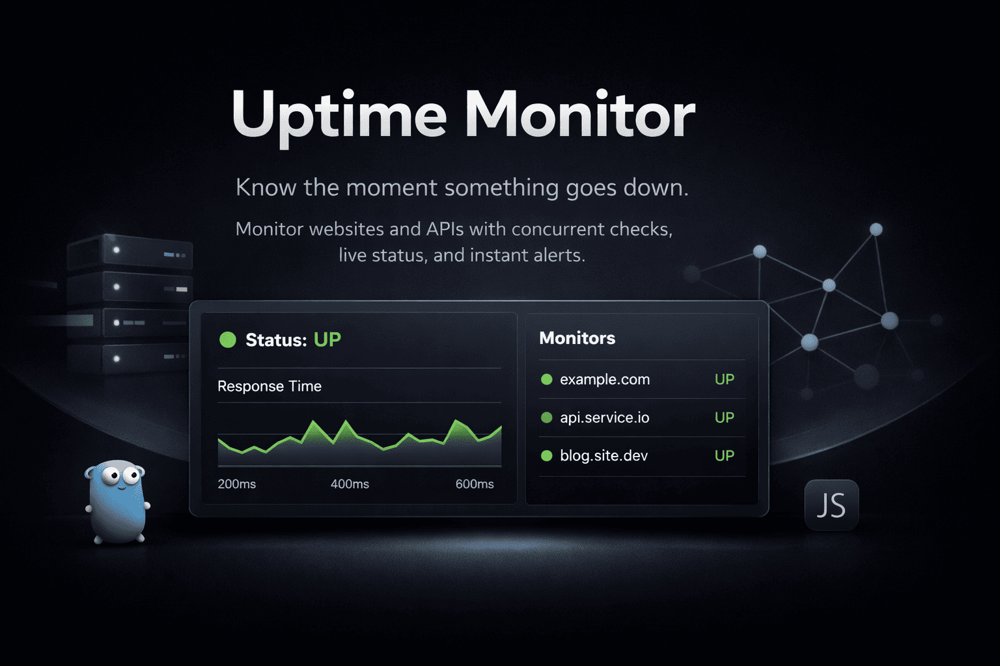

# uptime-monitor-web




The Next.js frontend for [uptime-monitor](https://github.com/the6fallenangel/uptime-monitor) — a concurrent, multi-user uptime monitoring service written in Go.

Users sign up, add websites/APIs to monitor at their own configured intervals, and get a live dashboard showing status, response times, and uptime history for each one.

## Features

- **Auth** — signup/login/logout backed by the Go API's JWT-in-httpOnly-cookie sessions; no tokens ever touch client-side JavaScript
- **Server-side route protection** — auth checks run in Server Components before any protected page renders, so there's no loading flash or unauthenticated flicker on refresh or direct navigation
- **Monitors dashboard** — create, edit, and delete monitors; live status badges that poll in the background and update without a page refresh
- **Monitor detail view** — check history table and a Statuspage-style uptime timeline with per-check tooltips
- **Account settings** — update display name, change password (current-password confirmation required)
- **Optimistic-feeling mutations** — create/edit/delete patch the local cache directly instead of refetching, so the UI updates instantly
- **Full loading/empty/error states** — skeleton loading throughout, not just spinners
- **Dark mode**, Apple-ish visual style via shadcn/ui, subtle entrance/status animations

## Tech stack

- **Next.js (App Router)** — Server Components for data fetching and auth gating, Client Components for interactivity
- **TypeScript**
- **TanStack Query** — server-state caching, background refetching, mutation-driven cache updates
- **React Hook Form + Zod** — form state and schema validation
- **shadcn/ui + Tailwind CSS** — component primitives and styling, CSS-variable-based theming
- **next-themes** — dark mode

## Project layout

```
src/
  app/
    (auth)/           login, signup — redirects to /monitors if already authenticated
    (dashboard)/       monitors list, monitor detail, settings — redirects to /login if not authenticated
    page.tsx           public landing page
  components/
    auth/              auth forms and shared auth card
    monitors/          monitor card, create/edit dialogs, uptime timeline, checks table
    settings/          profile and change-password forms
    ui/                shadcn/ui primitives
  hooks/               TanStack Query hooks (use-auth, use-monitors)
  lib/                 API client, typed API functions per resource, Zod schemas, formatting helpers
```

## Usage

### Configure

```bash
cp .env.example .env.local
```

```env
NEXT_PUBLIC_API_URL=http://localhost:8080
```

Requires the [uptime-monitor](https://github.com/the6fallenangel/uptime-monitor) Go API running and reachable at that URL, with `FRONTEND_ORIGIN` on the backend set to match wherever this app is served from (CORS requires an exact origin match when credentials are involved).

### Run

```bash
npm install
npm run dev
```

Visit `http://localhost:3000`.

## CI

GitHub Actions runs on every push and pull request: install, lint, type-check (`tsc --noEmit`), and production build. Deployment is handled by Vercel's own GitHub integration — pushes to `main` deploy to production, pull requests get preview deployments automatically.

## Status

Feature-complete for a single-user-facing dashboard: auth, route protection, monitor CRUD with live status, check history with uptime visualization, and account settings. No automated test suite yet — the paired Go backend has full test coverage instead.
